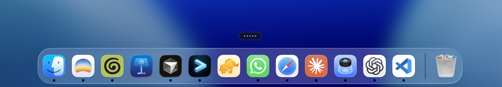
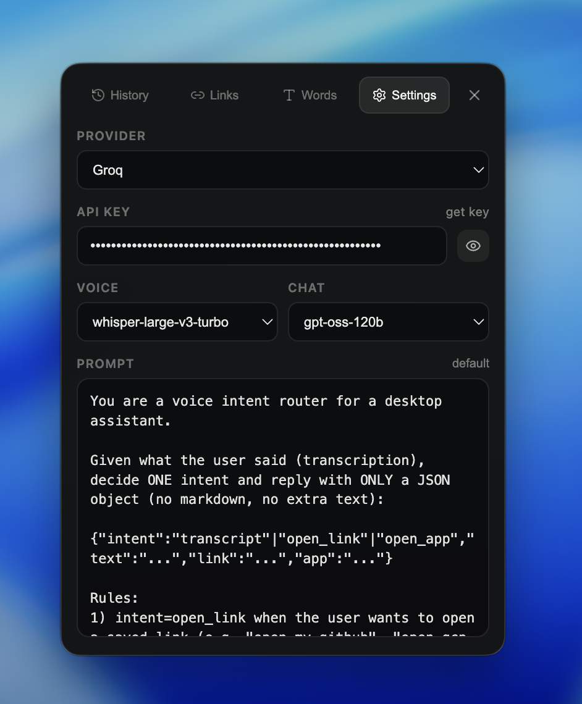
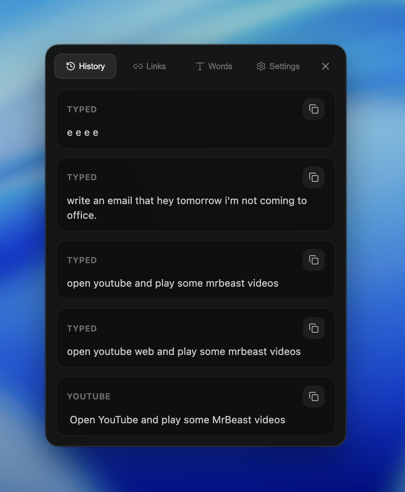
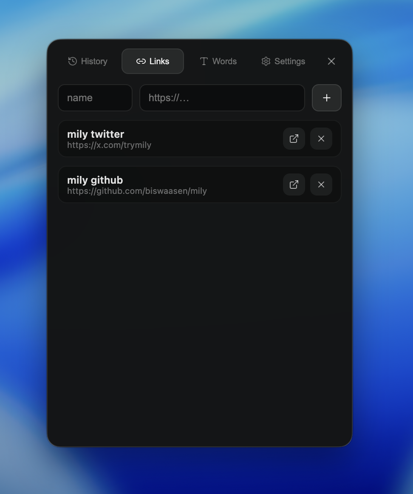
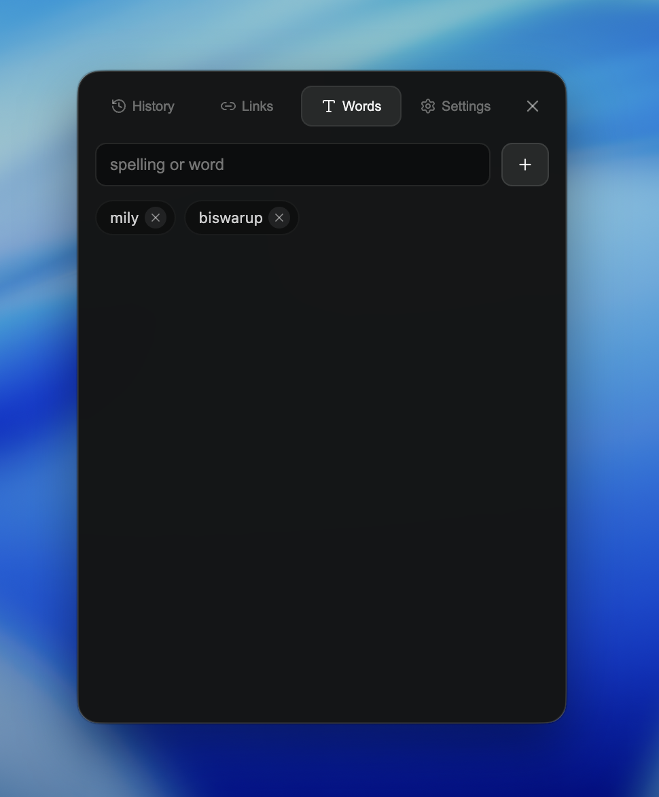

# Mily

A small, open-source macOS voice typing app. Hold **Fn/Globe** to speak, release to type, and use your own Groq API key.

## Start locally

Requires **macOS**, **Node.js 22.12+**, and **Xcode Command Line Tools** (`xcode-select --install`).

```sh
git clone https://github.com/biswaasen/mily.git
cd mily
npm ci
npm start
```

For development with renderer rebuilds, use `npm run dev`. No `.env` file is needed to run locally. Windows and Linux are not supported.

## 1. Left-click the small bar

**Left-click the five-dot bar above your Dock to open Mily.** The panel has History, Links, Words, and Settings tabs.



## 2. Add your API key first

Open **Settings → API key**. Click **get key** to create a [Groq API key](https://console.groq.com/keys), paste it into the field, and wait for **saved**. It saves automatically.

**An API key is required for transcription.** Keep it private; enter it in the app, not the source code or `.env`.

<p align="center">
  
</p>

- **Voice:** speech-to-text model.
- **Chat:** text cleanup and supported actions.
- **Prompt:** customize behavior; **default** restores the built-in prompt.
- **Spoken language:** choose a language if auto-detection gets it wrong. This control was added after the screenshot.

## 3. Speak and check History

Allow **Microphone**, **Accessibility**, and any requested **Automation** permissions in macOS Privacy & Security settings. Restart Mily after changing permissions.

Focus a text field, **hold Fn/Globe**, speak, then **release**. Keep that field focused while Mily processes and pastes your text. **Escape** cancels.

Open **History** to review recent transcriptions or copy a result.

<p align="center">
  
</p>

## 4. Save links and open them by name

In **Links**, enter a name and URL, then click **+**. Hold Fn and say **“Open” + the saved name**—for example, “Open mily github.” Use the open icon to launch a link manually or **×** to remove it.

<p align="center">
  
</p>

Saved links open in your browser. Mily does not search websites or play videos for you. The screenshot contains example links; this repository is **biswaasen/mily**.

## 5. Add custom words

In **Words**, add names or preferred spellings such as `mily` or `biswarup`, then click **+**. These help speech recognition and text cleanup. Click **×** to remove a word.

<p align="center">
  
</p>

## For developers

```sh
npm test
npm run typecheck
npm run build:react
```

See [DEVELOPING.md](DEVELOPING.md) for architecture, troubleshooting, packaging, and release setup. See [CONTRIBUTING.md](CONTRIBUTING.md) for pull requests.

**Privacy:** Audio and processing context are sent to Groq. Your API key, settings, and history are stored locally without application-level encryption. Read the [data notes](DEVELOPING.md#data-and-privacy) and [security guidance](SECURITY.md).

Licensed under [ISC](LICENSE).
